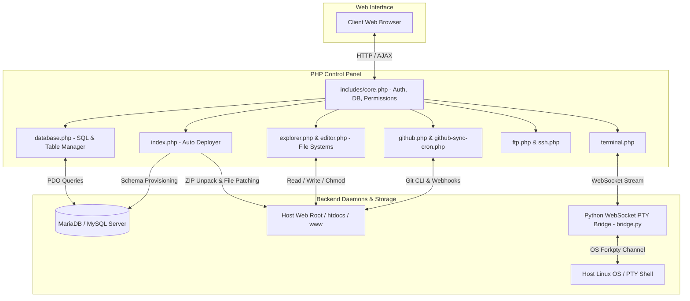

# 🎛️ XAMPP & LAMP Web Control Panel & Hosting Dashboard

<p align="center">
  
</p>

<p align="center">
  <strong>A modern, full-featured web hosting & server administration dashboard designed for XAMPP, LAMP, and LEMP stacks. Built with PHP 8+, MariaDB, TailwindCSS, and a Python WebSocket PTY Terminal Bridge.</strong>
</p>

<p align="center">
  <a href="https://github.com/ShriyashBPatil/xampp-dashboard/stargazers"></a>
  <a href="https://github.com/ShriyashBPatil/xampp-dashboard/network/members"></a>
  
  
  
  
  
</p>

---

## 📑 Table of Contents

- [Overview](#-overview)
- [System Architecture](#-system-architecture)
- [Key Modules & Capabilities](#-key-modules--capabilities)
  - [1. One-Click Project Auto-Setup & Deployer](#1-one-click-project-auto-setup--deployer)
  - [2. Integrated Database Management Suite](#2-integrated-database-management-suite)
  - [3. Interactive Web File Explorer](#3-interactive-web-file-explorer)
  - [4. In-Browser Code Editor](#4-in-browser-code-editor)
  - [5. GitHub Integration & Automated Sync Cron](#5-github-integration--automated-sync-cron)
  - [6. Real-Time Web Terminal & Python PTY Bridge](#6-real-time-web-terminal--python-pty-bridge)
  - [7. FTP & SSH Client Suite](#7-ftp--ssh-client-suite)
  - [8. Virtual Host & Project Router](#8-virtual-host--project-router)
  - [9. User Accounts & Role-Based Access Control (RBAC)](#9-user-accounts--role-based-access-control-rbac)
- [Directory Structure](#-directory-structure)
- [Installation & Setup](#-installation--setup)
- [Terminal Bridge Daemon Configuration](#-terminal-bridge-daemon-configuration)
- [Automated Sync Cron Configuration](#-automated-sync-cron-configuration)
- [Author & License](#-author--license)

---

## 🌟 Overview

Managing local development servers or VPS web hosting environments often requires switching between cumbersome tools like phpMyAdmin, cPanel, FileZilla, command-line SSH terminals, and Git CLI.

**XAMPP Dashboard** unifies all essential server management operations into a single modern control panel. It runs lightweight on top of PHP and MariaDB, providing one-click project installations, automated database patching, full web-based SQL query execution, file explorer operations, code editing, GitHub automated syncing, and a real-time WebSocket terminal.

---

## 🏗 System Architecture



---

## 🚀 Key Modules & Capabilities

### 1. One-Click Project Auto-Setup & Deployer
- **ZIP Archive Deployments**: Upload compressed application archives (`.zip`). The deployer automatically extracts contents into targeted web directories.
- **Automated Database Provisioning**: Upload an accompanying `.sql` database dump. The system creates the database and imports the schema automatically.
- **Smart Connection String Auto-Patching**: Scans extracted project files (`config.php`, `db.php`, `.env`, `database.php`) and patches database host, username, password, and database name to match the server environment seamlessly.

### 2. Integrated Database Management Suite
- Full-featured, lightweight phpMyAdmin alternative:
  - **Database Management**: Create, view, and drop databases with UTF-8 character encoding presets.
  - **Table Explorer & Structure**: Inspect schemas, primary keys, indexes, table sizes, and row counts.
  - **SQL Query Console**: Execute raw SQL queries, transactions, and multi-line batch scripts with syntax formatting.
  - **Inline Record Editor & Pagination**: Browse, filter, edit, and delete rows directly from the table view.
  - **Export & Import**: Export schemas and table data directly to `.sql` files or import existing dumps.

### 3. Interactive Web File Explorer
- Visual file browser with hierarchical navigation:
  - Create folders, create files, rename, copy, move, duplicate, and delete.
  - Multi-file drag-and-drop uploads.
  - In-browser archive compression and decompression (`.zip`).
  - File permissions editor (`chmod` 0755, 0644, 0777).

### 4. In-Browser Code Editor
- Integrated code editor supporting PHP, JavaScript, CSS, HTML, JSON, and SQL syntax highlighting.
- Line numbering, search/replace, keyboard shortcuts (`Ctrl+S` / `Cmd+S` auto-save), and instant file reloading.

### 5. GitHub Integration & Automated Sync Cron
- Link personal GitHub accounts via Personal Access Tokens.
- List remote repositories and clone them directly into project subdirectories.
- Execute branch switching, `git pull`, commit tracking, and push operations.
- **Automated Cron Syncing (`github-sync-cron.php`)**: Run continuous background synchronization to keep web applications automatically updated with remote GitHub repository changes.

### 6. Real-Time Web Terminal & Python PTY Bridge
- Full pseudo-terminal (PTY) accessible in the browser.
- Backed by an eventlet/Socket.IO Python daemon (`bridge.py`) that forks an active PTY session.
- Supports ANSI colors, interactive command line utilities (`top`, `vim`, `htop`), signal forwarding, and terminal resizing.

### 7. FTP & SSH Client Suite
- **Web FTP Client**: Connect to remote FTP/FTPS servers, browse remote directory trees, download, and upload files.
- **Web SSH Client**: Configure and save remote server host credentials for direct SSH administration.

### 8. Virtual Host & Project Router
- Manage multi-site virtual host configurations, custom development domains, and port mappings.

### 9. User Accounts & Role-Based Access Control (RBAC)
- Admin and User roles with granular permission switches (`can_autosetup`, `can_manage_db`, `can_use_terminal`, `can_edit_files`).
- **Guest Mode**: Read-only safe browsing mode preventing accidental modifications.

---

## 📂 Directory Structure

```
xampp-dashboard/
├── index.php                 # Main dashboard, telemetry & auto-setup deployer
├── database.php              # Full web database & SQL manager
├── explorer.php              # Interactive web file manager
├── editor.php                # Syntax-highlighted code editor
├── github.php                # GitHub repo manager & sync center
├── github-sync-cron.php      # Automated background sync cron script
├── ftp.php                   # Browser-based FTP client
├── ssh.php                   # Browser-based SSH client
├── terminal.php              # In-browser web terminal interface
├── projects.php              # Project catalog & virtual hosts
├── account.php               # User account & credential manager
├── settings.php              # Control panel preferences & theme toggles
├── login.php                 # Authentication login page
├── logout.php                # Session termination handler
├── favicon.ico / favicon.svg # Application brand icons
├── includes/                 # Shared core engine
│   ├── core.php              # Auth engine, DB connection helper, permissions
│   ├── header.php            # Global responsive navigation bar
│   ├── footer.php            # Global footer & JS bindings
│   ├── github.php            # GitHub API client functions
│   └── ftp.php               # FTP connection abstractions
└── terminal-bridge/          # Python WebSocket PTY bridge daemon
    ├── bridge.py             # Socket.IO PTY server (eventlet)
    └── requirements.txt      # Python dependencies (Flask, Flask-SocketIO)
```

---

## 🛠️ Installation & Setup

### 1. Requirements
- PHP 8.0+ with extensions: `pdo_mysql`, `curl`, `zip`, `mbstring`
- Apache, Nginx, or Caddy web server
- MariaDB or MySQL
- Python 3.8+ (for Web Terminal)

### 2. Deploy into Web Root
Clone the repository directly into your web root directory (e.g. `/var/www/html/dashboard` or `htdocs/dashboard`):

```bash
cd /var/www/html
git clone https://github.com/ShriyashBPatil/xampp-dashboard.git dashboard
```

### 3. Permissions
Ensure web server write permissions:
```bash
sudo chown -R www-data:www-data /var/www/html/dashboard
sudo chmod -R 755 /var/www/html/dashboard
```

### 4. Database Setup
The dashboard automatically initializes its own database (`xampp_dashboard`) and user tables upon first access. Open:
```
http://localhost/dashboard
```

---

## 💻 Terminal Bridge Daemon Configuration

To enable the live browser terminal:

```bash
cd /var/www/html/dashboard/terminal-bridge
python3 -m venv venv
source venv/bin/activate
pip install -r requirements.txt
python3 bridge.py
```

### Run Terminal Bridge as a Background Systemd Service:
Create `/etc/systemd/system/xampp-terminal-bridge.service`:

```ini
[Unit]
Description=XAMPP Dashboard Terminal WebSocket Bridge
After=network.target

[Service]
User=root
WorkingDirectory=/var/www/html/dashboard/terminal-bridge
ExecStart=/var/www/html/dashboard/terminal-bridge/venv/bin/python bridge.py
Restart=always
RestartSec=3

[Install]
WantedBy=multi-user.target
```

Enable and start:
```bash
sudo systemctl daemon-reload
sudo systemctl enable xampp-terminal-bridge
sudo systemctl start xampp-terminal-bridge
```

---

## ⏰ Automated Sync Cron Configuration

To run automatic GitHub synchronization every 5 minutes:

```bash
crontab -e
```
Add the following line:
```cron
*/5 * * * * /usr/bin/php /var/www/html/dashboard/github-sync-cron.php > /dev/null 2>&1
```

---

## 👨‍💻 Author & License

**SHRIYASH PATIL**
- GitHub: [@ShriyashBPatil](https://github.com/ShriyashBPatil)
- Website: [shriyashpatil.in](https://shriyashpatil.in)

Released under the **MIT License**. Copyright (c) 2026 Shriyash Patil.
